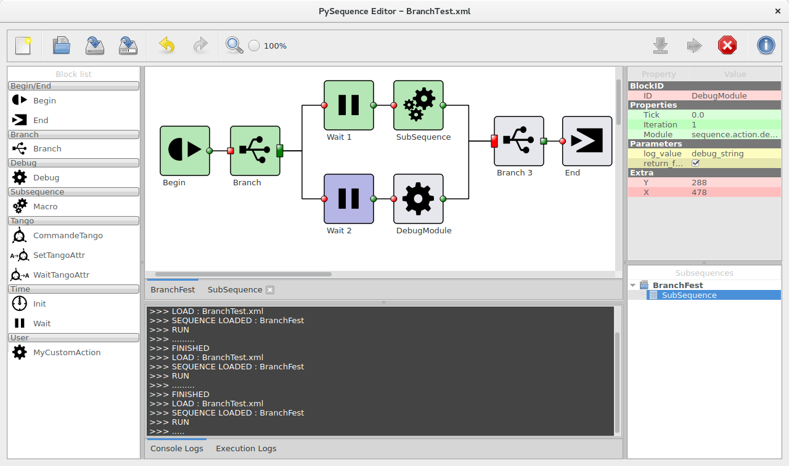

python-sequence
===============

This package contains tools to create, edit and run action-based sequences.

Requirement
-----------

- Python 2.7
- PyQt 4

Installation
------------

    $ python setup.py install

Usage
-----

Three main applications are available:

 - A console interface :

        $ python -m sequence.console  # Or
        $ sequence-console

 - A PyQt based sequence runner :

        $ python -m sequence.runner  # Or
        $ sequence-runner

 - A PyQt based sequence editor :

        $ python -m sequence.editor  # Or
        $ sequence-editor

Documentation
-------------

A sphinx generated documentation is available [here](http://vxgmichel.github.io/python-sequence)

License
-------

python-sequence is licensed under the [GPLv3](http://www.gnu.org/licenses/gpl-3.0-standalone.html)

Author
------

Vincent Michel @ NEXEYA SYSTEMS
